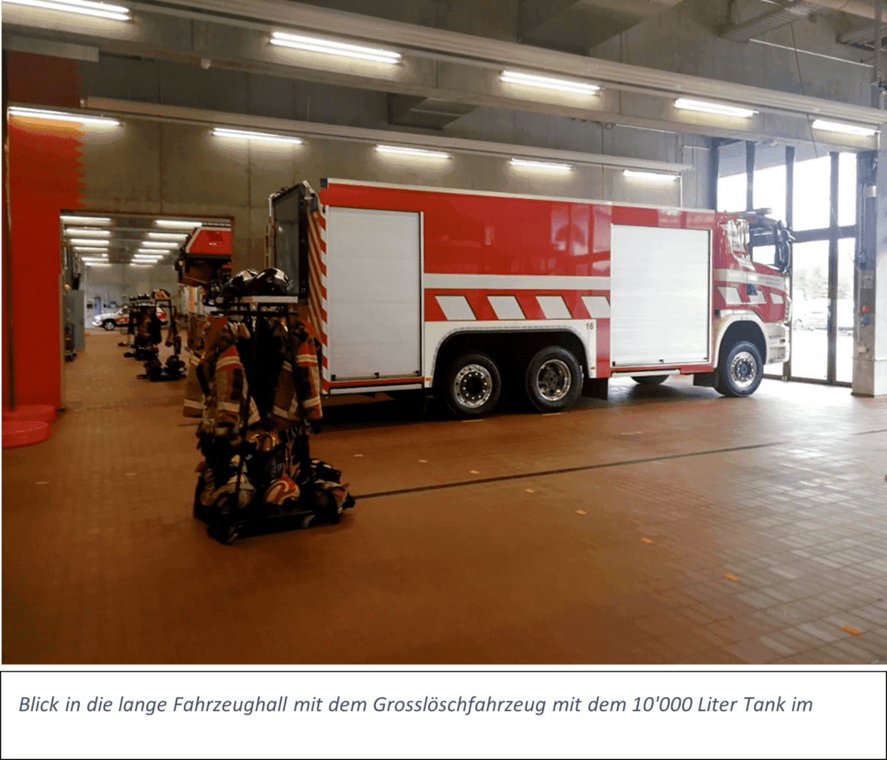

+++
title = "Reportage Berufsfeuerwehr Bern"
draft = true
+++
# Was hinter den Toren geschieht – zu Besuch bei der Berufsfeuerwehr Bern

Eine Reportage von Linus Kradolfer und Fabrice Bouquet

#### *Die Berufsfeuerwehr Bern löscht nicht nur Brände. Diese machen nur ca. 10% der Einsätze der Berufsfeuerwehr aus. Die Berufsfeuerwehrleute sind jedoch nicht ständig im Einsatz. Um zu erfahren, was die Berufsfeuerwehrleute ausserhalb von Einsätzen machen, haben wir die Berufsfeuerwehr Bern besucht.*

An einem regnerischen Freitag, kurz vor zwei Uhr nachmittags, finden wir uns im Berner Forsthaus ein. Wir betreten den Haupteingang der grossen Feuerwehrkaserne. Zuvor haben wir uns für eine kleine Führung durch das Gebäude angemeldet. Mit einem Knopfdruck werden wir mit jemandem verbunden, der sagt, dass uns bald die Tür geöffnet wird. Kurz darauf öffnet ein freundlicher Berufsfeuerwehrmann, der sich als Kevin Nideröst vorstellt, die Eingangstür und begrüsst uns. Um eine andere Tür, die in die Fahrzeughalle führt, zu öffnen, muss er seine Hand an einen Handleser halten.

